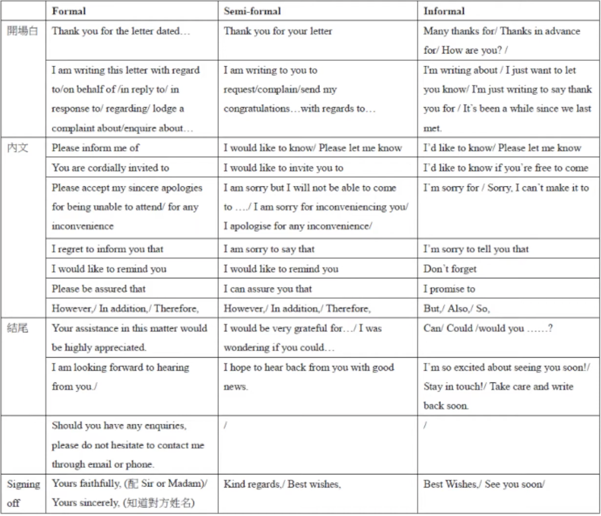

* Task 1 佔 Writing 裡面三分之一的分數。
* 時間分配：不要超過 20 分鐘，要留下 40 分鐘給自己去做 Task 2。
* 字數方面：建議寫 160 至 200 字，不要太多。
* 你的任務是需要你寫一封信，種類可能是一封：
    - 投訴信
    - 申請信
    - 求職信
    - 辭職信
    - 建議信
    - 邀請信
    - 道歉信
    - 或者你提出一些要求，徵求別人給你一些意見。
* 建議先花 2 分鐘審題，決定使用哪一個 formality、哪一個 tone 去寫這篇文章。用字上是差很遠的，就算是同一封信一模一樣的內容，寫法也是不太一樣。由開場白、內文到結尾都很不同。Formality 是最重要的！！！
* 最重要的地方就是 Formality（形式/語氣(tone)），這完全取決於對象。究竟是寫給什麼人，主要分成
    - 正式（formal）: 寫給一些公司、經理，或是寫給一些你連他名字都不知道的人。開頭用 "Dear Sir or Madam"，寫給不知名的人。
    - 半正式（semi-formal）: 寫給一些譬如老師、鄰居。通常你會稱呼他的姓氏（last name），例如 "Dear Mr. [Surname]"。
    - 非正式（informal）: 主要都是寫給一些朋友、同學或家人。主要你會直接稱呼他的名字（first name）。
* Formal 該怎麼寫？
    - 刻意用一些比較斯文、正式的用字。例如「我很遺憾地通知你一件事」，正式會說 "I regret to inform you..."。如果你不幸在找工作或申請大學失敗時收到信，開頭通常就是由這一句開始的。
    - 關於結尾簽署，在正式信件中，如果知道對方名字，用 "Yours sincerely"；如果不知道名字（即開頭用 Dear Sir or Madam），就應該用 "Yours faithfully"。
* Informal 該怎麼寫？
    - 刻意去用縮寫（abbreviations），例如 "I'm writing about..."、"It's been a while..."、"I'd like to know..."、"I'm sorry to tell you that..."(我很遺憾地通知你一件事)，這些都是刻意去表現一種親切的感覺。
    - 關於結尾簽署，在非正式信件中可以用 "Best wishes" 或 "See you soon"。
* Semi-formal 該怎麼寫？
    - 可參考最下面表中的寫法，它是介乎兩者之間：既不用縮寫，但也不至於用到非常隆重、正式、得體的字眼。一般來說，如果你上班時和同事用電郵溝通，大約就是寫這種 Semi-formal。
* 用 2 分鐘寫一個簡單的大綱。構思內容可能很難，我介紹大家一個方法叫 SPEARS（長矛）：
    - S (Situation)： 事情的概況。提供一些背景資料。譬如這個 Task 是想退一張機票，你就要先說你在哪年哪月買了一張去哪裡的機票。
    - P (Problem)： 你遇上的問題。例如：「我當時不小心買錯了，因為與你們的代理（agent）溝通不好，購買的日子出錯了。」
    - E (Elaboration)： 進一步詳細解釋時間、地點、人物的細節。例如在哪間旅行社買、哪位 agent 接待、溝通時發生了什麼誤解（miscommunication），詳細講清楚這些資料。
    - A & R (Action Required)： 你寫這封信一定有事想別人幫你做。你想對方賠錢？改日期？還是怎樣？要講清楚。
    - S (Solutions)： 解決辦法。這不一定適用於所有情況，但例如寫道歉信時，你想提出一個解決方案，主動幫別人做回一些事情，這就是 Solution。
* 文章結構方面可以分五段：
    - Greeting (問候)
    - S + P (背景與問題)
    - E (詳細解釋)
    - AR + S (要求行動與方案)
    - Signing off (結尾簽署)
* IELTS 是英語考試，記得留下 1 至 2 分鐘做校對 (Proofreading)，語法（grammar）錯誤或拼寫（misspelling）錯誤是很致命的，會逐個扣分。不要做完美主義者，用完這 20 分鐘後就結束，因為你還有三分之二的分數在 Task 2，要直接進入下一部分。
* 