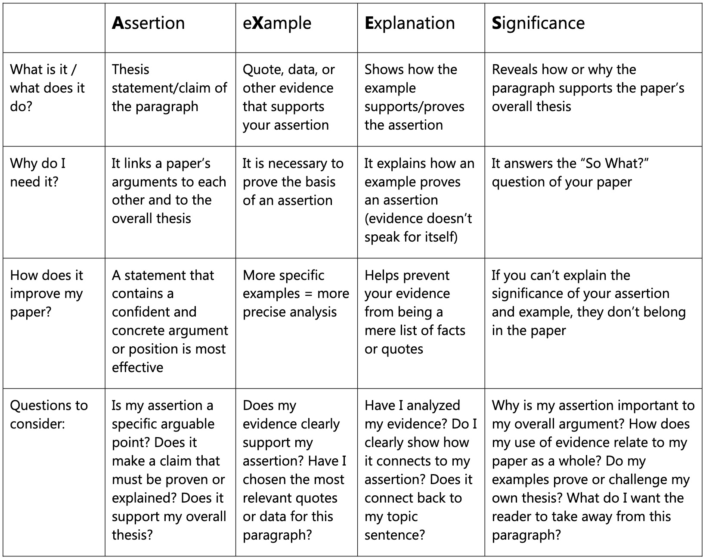

IELTS Writing Task 2 全攻略

* 就 Task 2 來說，是 66.7%。
* 建議字數大約是 250 至 300 字。
* 分為四至五段式這樣去寫。
* 我們建議用一個 introduction 一段，加兩至三個 main points，以及一個 conclusion 的部分。
* 時間方面，建議用 40 分鐘。
* Introduction: 
    - 希望用兩句，大約少於 50 字就講完。首先第一句講一下背景。背景其實題目已經給你了。所以最重要的是去 paraphrase 題目。例如我們可以將句式結構改變、詞彙的詞性改變，或者用一些 synonyms（同義詞）去取代一些字眼。
    - 千萬要將題目的字眼改頭換面一次，否則 Lexical Resource（詞彙豐富度）那邊我們可能會被扣分。
    - 第二句，我們會講回自己的立場 (stance)。我們究竟是同意還是不同意一個陳述 (statement) 呢？
* Body Paragraphs:
    - 重點：extended and well-supported ideas（擴展且有充分支持的觀點）
    - 主題句、解釋、例子，以及小結。
    - 可以嘗試用以下這個結構：一句 topic sentence（主題句）、一至兩句 elaboration（詳盡闡述）、一至兩句 examples（例子），以及一句 conclusion（結論句）。這樣就組成完整的一段段落結構。兩至三段內文都是這樣做。
    - Example:
        - 第一句主題句： 科技可以拉近人與人的距離。很簡單。把這作為一個 main point 就是一句。
        - 詳盡闡述： 闡述有兩種方法。
            - 第一種是進一步解釋我們主題句所講的東西就可以了。譬如 social media（社交媒體），可以讓我們根據不同興趣、嗜好，加入不同的群組、專頁。這樣就可以透過這些興趣認識不同的人，沒有地域限制。即使不同國家的人，我們都可以認識。這就是其中一個 elaboration（描述功能、因果關係及解釋機轉）。
            - 另一種方法呢，不是直接解釋，而是提供一些主題句相關的背景資料給讀者知道。譬如說，原來在未有社交媒體之前，我們主要透過教堂、社區中心、參加義工活動來認識朋友，建立我們的 community（社群）。而我們認識的朋友，很多時候也比較受地域限制，可能僅限於我們的 local community（本地社群）。這些就是一些背景資料（描述(先前、假設)沒有此例子的情況）。
        - 實際例子： 一至兩句就可以了。舉例最大的好處是將抽象的東西具體化。我們一般可能以 for instance、for example 開頭。我們也可以說 things like 可能 Facebook、Twitter 或者 Snapchat。它們都是社交媒體的典型例子。讓我們拉近彼此之間的距離，令我們跨越地域界限去交朋友。
        - 結論句： 只需要將這一段總結 (summarize) 一次就可以了。所以這裡注意，也要將字眼改頭換面，做一個 paraphrase。
    - 正式學術論文的段落架構是AXES, AXEXES (two pieces of evidence with explanation), or AXEAXES (two claims with evidence before the significance), 其中
        - Assertion (A): making a claim.
        - eXample (X): providing evidence for your claim. Quote, data, or other evidence that supports your assertion.
        - Explanation (E): explaining why you chose that evidence. Shows how the example supports/proves the assertion.
        - Significance (S): revealing how or why this paragraph supports your paper’s overall thesis.
        - These elements (A, X, E, S) may sometimes be rearranged or repeated. (i.e. AEXEXS, AEEXS, AXEXE).
        - For more information and the roles of each element (A, X, E, S), please refer to the appended table. 
* Conclusion: 
    - 簡單的 conclusion，用兩至三句去總結全篇文章。
    - 切記這裡我們只不過是總結剛才所講的那兩三個 main points。
    - 盡量不要重複那兩三個論點的主題句，而是再用 paraphrasing skills（改寫技巧）。
    - 不要再加新的重點，不要再加新的 main points。因為已經來到結尾部分，就只是總結。

* Sentences:
    - Sentence Structure: To help your reader follow the development of your arguments, always begin your sentence with information, concepts, or definitions you have already explained, and then introduce new ideas at the end of the sentence. This familiar first, new last structure will ensure that the presentation of your content follows a logical progression and doesn't confuse or disorient your reader.
    - 以 IELTS 為例，評分準則中的「文法多樣性與準確性」(Grammatical Range and Accuracy)，其實就是考察你是否能運用複雜且多變的句型。
    - 使用深奧的單字，但若句型無法配合，最終只能使用最簡單的結構，那就像繫了一條華麗的領帶卻穿著一套破爛的西裝，整體感覺並不協調。
    - 五個技巧擺脫單調的英文句型(只要涉及英文寫作，靈活多變的句型都非常重要)。
        - 「被動語態」(Passive Voice)
        原句：The government should quickly adopt such measures to achieve...（政府應迅速採取這些措施以達成……）
        改為：Such measures should be quickly adopted to...（這些措施應被迅速採取以……）
        原句：We can tackle such problems by...
        改為：Such problems could be tackled by...
        這能讓文章開始產生變化。
        - 「關係從句」(Relative Clause)
        例如 which、in which 等。
        原句：The authorities should adopt these measures. These measures can help...（當局應採取這些措施。這些措施能幫助……）
        改為：The authorities should adopt these measures which can help...
        原句：The authorities should adopt these measures. Under these measures, citizens can...
        改為：The authorities should adopt these measures under which citizens can...
        透過 which 將兩個句子連結，能提升流暢度。
        - 「條件句」(Conditionals) 分為四類：
        Type 1 (真理)： 條件與結果均為現在式 → 現在式（如：水加熱到 100 度會沸騰）。
        e.g. If water reaches 100 C, it boils.
        Type 2 (正常情況)： 未來可能發生的事，現在式 → 未來式。
        e.g. If it rains, we will stay at home.
        Type 3 (純想像)： 與現在事實相反、極不可能發生之事（如：如果我是你）。
        e.g. If I were you, I would not go. (與現在事實相反)
        e.g. If I had a pair of wing, I would fly to Tokyo. (與現在事實相反且極不可能發生之事)
        Type 4 (遺憾/與過去事實相反)： 已發生的事，表示「早知道就這樣做」（如：如果我今早有吃早餐）。
        e.g. If I had eaten breakfast this morning, I would not have been so hungry.
        e.g. If the government had adopted the above measures, there would not have been such problems. (與過去事實相反)（如果政府當初有採取上述措施，就不會出現這些問題）這在表達複雜句型（Complex meaning）時相當實用。
        若能將這些條件句擺進文章，能進一步增加多樣性。特別是 Type 3 和 Type 4，更能向考官展示實力。尤其是 Type 4 非常適合議論文。
        - 「倒裝句」(Inversion)
        Type 1 (Not only... but also (不僅……而且)): 
        原句：The authorities should not only do this, they should also do that.
        改為：Not only should the authorities do this, but they should also do that.
        這樣就能達成倒裝的效果，此類倒裝非常常見。
        Type 2 (否定副詞放句首)
        原句：We can do this under no circumstances.（我們絕不能這樣做）。
        改為：Under no circumstances can we do this.（絕不容許我們這樣做）。
        在此例中，將 Under no circumstances 擺在最前面，然後將 we can 倒裝為 can we。此法舉一反三，例如：On no account should the government do this.
        - 「名詞化」(Nominalization)
        Type 1 (動詞名詞化)
        原句：The plan was implemented successfully and this brought immense profit to the company.
        改為：The successful implementation of the plan brought immense profit to the company.
        只需將原句「副詞 + 動詞」名詞化。
        Type 2 (形容詞名詞化)
        原句：This is very important. 
        改為 It is of (utmost/crucial/significant) importance.
        將形容詞 important 轉為名詞 importance。
* 如何準確且多樣化地做 paraphrase？
    - 以 IELTS 為例，評分準則中的「詞彙豐富度」(Lexical Resource)，其實就是考察你是否能Paraphrasing（改寫），如果重複題目的字眼太多次，該評分項目就會被大幅扣分。
    - 四個方法複述題目意思
        - Type 1 Synonym（同義詞），即用同義字來替代。
        car（汽車）→ 我們可以改用 motor vehicles。
        Companies（公司）→ 我們可以改為 businesses。
        negative impact（負面影響）→ 我們可以改為 adverse effect 或者 adverse consequences。
        should be banned（應該被禁止）→ 我們可以說 should be prohibited 或者 should not be allowed。
        我們用不同的同義詞，就可以用不同的方式表達同一個字詞的意思。
        在專有名詞的替換上要很小心。有些概念只是「相似」而非「相同」。
        題目講 town（小鎮），我們能不能改為 city（城市）？這是不行的。因為 town 只是小城鎮，而 city 是大城市，是兩個概念。
        題目用 vegetarian（素食者），我們能不能用 vegan（純素主義者）？原來也是不行的。因為 vegetarian 是指那些仍會吃動物產品（如雞蛋、牛奶）的素食者；但 vegan 則是完全不吃任何動物產品的純素者。
        - Type 2 改變詞性（Word Form）
        Paraphrasing 不僅是一個找同義詞的遊戲。如果你想不到同義詞，改變詞性也是一個非常聰明的做法。
        原句：It is very important.（這非常重要）
        改為：It is of utmost importance.
        原句的 important 是形容詞（adj.），這裡我們用了 of，然後將它變成了名詞（n.）importance。
        原句：The plan was successfully implemented.（計劃被成功執行）
        改為：the successful implementation of the plan.
        本來原句是一個副詞（adv.）加一個被動語態的動詞（v.）。我們可以將 successfully 變成形容詞，implemented 變成名詞。
        原句：rapidly increased（快速增長）
        改為：a rapid increase in。
        原句是副詞加動詞。我們可以變成形容詞加名詞。這在圖表題中非常有用。
        - Type 3 將主動（Active）與被動（Passive）的型態互換。
        原句：Many people believe that...（許多人相信……）
        改為：It is generally believed that...（普遍認為……）
        這樣子的調整能達到同樣的效果。
        原句：$3 million were invested in...（三百萬被投資在……）
        改為：The company invested $3 million in...（公司投資了三百萬在……）
        將原句中的被動改為主動
        - Type 4 改變句子結構（Sentence Structure）。
        怎樣令結構更多元化而非一直用很悶又簡單的 SVO（主動賓）句式？
        1. 重組從句順序（Order of clauses）：
        看這個例子：It is rather difficult to say whether the tourism will be revived during this summer.這個句子有兩個 clause（子句）。我們可以將 whether 到 summer 這一段抽到前面，變成：Whether the tourism will be revived during this summer, it is rather difficult to say. 這樣寫出來就沒那麼單調。
        2. 用關係從句（Relative Clause）：
        這很簡單。如果你看到一個句子的結尾和下一個句子的開頭是同一個名詞，你就可以用 which 把它連起來。例如：The authorities should adopt these measures. These measures can help...改為：The authorities should adopt these measures which can help... 另一種情況，如果句尾是名詞，下一句開頭是同樣的名詞且前面有介係詞（Preposition）：例如：The authorities should adopt these measures. Under these measures, citizens can...我們可以改為：The authorities should adopt these measures under which citizens can...這就是我們常看到的 in which、on which 等用法。
        
* Cohesion
    - Cohesion refers to the construction of individual sentences and the clear relationships you establish between them. Each sentence should connect to the ones before and after it, while providing clear topics (what the sentence is about) and stresses (what is important about the sentence). Think of this as the micro level of clarity in your paper.
* Coherence
    - Coherence refers to the overall sense of unity among your ideas and clarity of your writing structure. It consists of linking together the key claims you are making in each sentence, each paragraph, and finally in your paper as a whole. Think of this as the macro level of clarity in your paper.